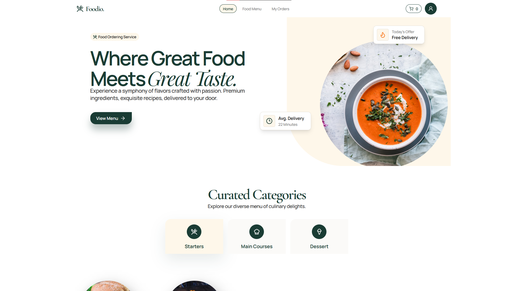
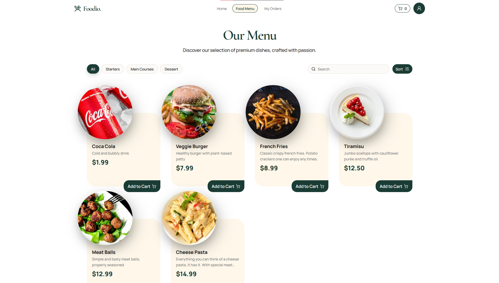
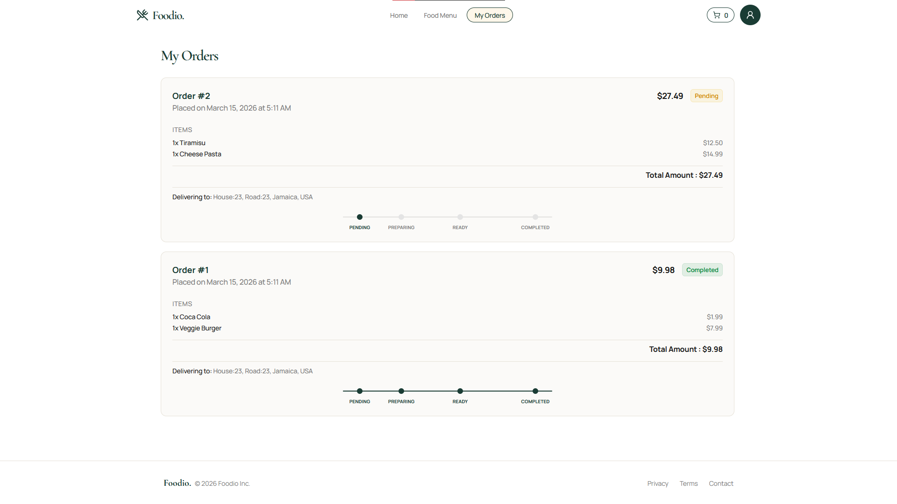
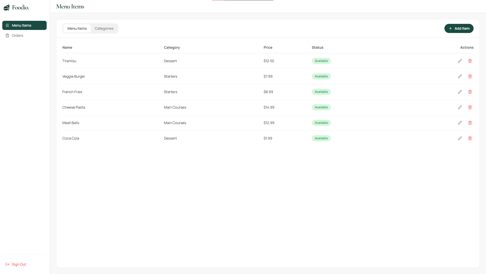

# Foodio - Restaurant Ordering System

A premium, simplified Restaurant Ordering System built with Next.js, NestJS, and PostgreSQL.

## Screenshots

<table>
  <tr>
    <td></td>
    <td></td>
  </tr>
  <tr>
    <td></td>
    <td></td>
  </tr>
</table>

## Features

- **Public Site**: Browse categories and menu items, search, and filter.
- **User Authentication**: Secure login and registration with JWT.
- **Cart Management**: Add multiple items to a persistent cart.
- **Order Placement**: Consolidated order submission with price and availability validation.
- **Order Tracking**: Real-time status tracking for users (Pending -> Preparing -> Ready -> Completed).
- **Admin Dashboard**: Comprehensive management of categories, items, and the order queue.

## Tech Stack

- **Frontend**: Next.js 16, TypeScript, Tailwind CSS, Framer Motion, Lucide Icons.
- **Backend**: NestJS, TypeORM, PostgreSQL, Passport.js, JWT.

### Prerequisites

- Node.js (v20+)
- PostgreSQL database (or Docker)

## Setup Instructions

1. **Install dependencies** from the root directory:

   ```bash
   npm install
   ```

2. **Monorepo workspace commands** (from root):

   ```bash
   npm run dev
   npm run build
   npm run lint
   npm run type-check
   npm run validate
   npm run test
   ```

   - `dev` runs both backend and frontend workspaces.
   - `test` currently targets backend tests.

3. **Start the whole application** (Production-ready):

   ```bash
   docker compose up --build
   ```

   - Default ports: Backend: 3000, Frontend: 3001

4. **Start in Development mode** (with hot-reloading):

   ```bash
   docker compose -f docker-compose.dev.yml up --build
   ```

   _This will mount your local files into the containers, so they refresh automatically when you save._
   - Default ports: Backend: 3000, Frontend: 3001

### Docker via npm scripts

You can also use root workspace Docker helpers:

```bash
npm run docker:dev
npm run docker:dev:down
npm run docker:prod
npm run docker:prod:down
```

### Alternative: Manual Setup

If you prefer to run services manually:

1. **Start the database**: `docker compose up -d db`
   _This will build and start the database. If you want to start the database manually, run a PostgreSQL instance and make sure it has a database named `foodio` or the database name set through `.env` file._
2. **Backend**:
   - `cd backend`
   - `npm run start:dev` / `npm run start:prod`
     - _Note: The database will be seeded automatically on the first run if empty, the data that will be seeded depends on `SEED_INITIAL_DATA` environment variable value._
     - For development build `copy .env.example .env` (Windows) or `cp .env.example .env` (Linux/Mac)
     - _Note: For production build `.env` file will be ignored._
     - _Note: Database migrations run automatically on startup. To generate a new migration after entity changes:_

```bash
   npm run migration:generate
```

```env
DB_HOST=localhost # PostgreSQL database instance host
DB_PORT=5432 # PostgreSQL database instance port
DB_USERNAME=postgres # PostgreSQL database instance username
DB_PASSWORD=postgres # PostgreSQL database instance password
DB_NAME=foodio # The database name
JWT_SECRET=supersecret # Used for JWT signing and verification
ADMIN_EMAIL=admin@foodio.com # Default admin email
ADMIN_PASSWORD=admin123 # Default admin password
SEED_INITIAL_DATA=true # Set this to false if you don't want to seed the database with some default user and food values
PORT=3000 # Backend port
```

3. **Frontend**:
   - `cd frontend`
   - For development build `copy .env.example .env` (Windows) or `cp .env.example .env` (Linux/Mac)

   ```env
   NEXT_PUBLIC_API_URL=http://localhost:3000 # Backend API URL
   PORT=3001 # Frontend port
   ```

   - `npm run dev`

## Default Credentials

- **Admin**: `admin@foodio.com` / `admin123`
  - _Note: The initial admin account's email and password can be set through environment variables `ADMIN_EMAIL` and `ADMIN_PASSWORD`._
- **Seeded User**: `user@foodio.com` / `user123`
  - _Note: If the environment variable `SEED_INITIAL_DATA` is not set or set to `false`, this user won't be created._
